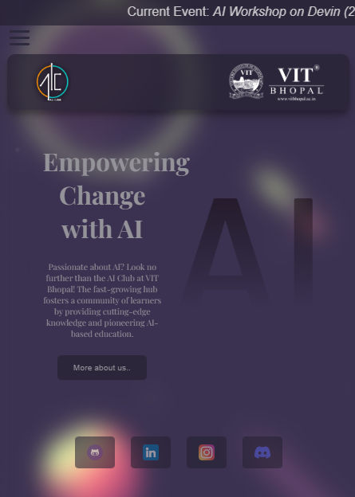

# AI Club's Website
This project is associated with the AI Club at VIT University. It is a website built using HTML5 and CSS3 within 12 hours, and it is designed to be responsive. \
**Check it out using this** [**link**](https://parazeeknova.github.io/AI-Club-Website/)

## 📸 Desktop View

## 📱 Mobile View

## 💡Features

- ***Responsive design***: The website is optimized for different screen sizes, ensuring a seamless user experience across devices, including mobile devices.
- ***AI Club information:*** The website provides information about the AI Club, including its mission, activities, and events.
- ***Animations:*** The website includes *animations in the background and elements* to enhance the visual appeal and user engagement.

## 🌴 Contributing

Contributions are welcome! If you'd like to contribute to the project, please follow these steps:

1. Fork the repository.
2. Create a new branch: `git checkout -b feature/your-feature-name`
3. Make your changes and commit them: `git commit -m 'Add some feature'`
4. Push to the branch: `git push origin feature/your-feature-name`
5. Submit a pull request.

## 📃 License

This project is licensed under the **MIT License**.
